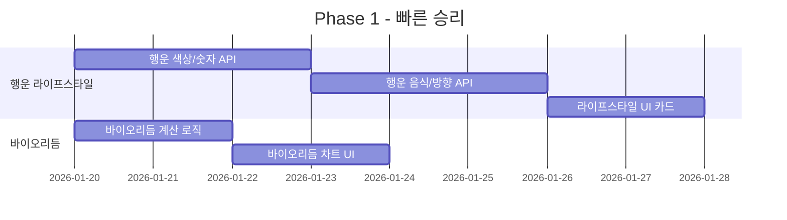
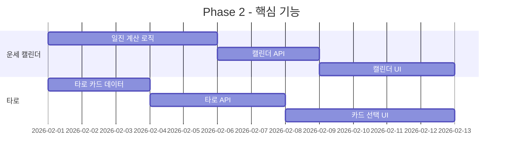

# 한사앱 벤치마킹 종합 분석 및 기능 구현 로드맵

**작성일**: 2026년 1월 18일
**분석 대상**: 점신, 청월당, 포스텔러
**목적**: 한사앱 기능 확장 및 개선 방향 도출

---

## 1. 경쟁사 핵심 분석 요약

### 1.1 점신 (Jeomsin) - 1,900만+ 사용자
| 핵심 차별점 | 설명 |
|------------|------|
| **라이프스타일 연계** | 운세를 의상/음식/취미(골프/야구)와 연결 |
| **시간대별 운세** | 오전/오후/저녁 세분화된 운세 (업계 최초) |
| **AI 관상** | 카메라로 얼굴 촬영 후 AI 분석 |
| **게이미피케이션** | 복주머니 적립 → 상품 교환 |
| **잠금화면 위젯** | 잠금화면에서 바로 운세 확인 |

### 1.2 청월당 (Cheongwoldang) - MAU 100만+
| 핵심 차별점 | 설명 |
|------------|------|
| **웹툰 스토리텔링** | 캐릭터 기반 운세 풀이 (청월아씨, 홍연아씨 등) |
| **ChatGPT 연동** | GPT 스토어 라이프스타일 부문 세계 1위 |
| **AI 해몽** | 꿈 해석 서비스 |
| **유명인 사주** | 화제 인물 사주 분석으로 바이럴 |
| **글로벌 진출** | 다국어 지원 (영어/일본어/중국어) |

### 1.3 포스텔러 (Forceteller) - 860만+ 사용자
| 핵심 차별점 | 설명 |
|------------|------|
| **콘텐츠 볼륨** | 6,000개+ 콘텐츠 (운세 넷플릭스) |
| **동서양 통합** | 사주+점성술+타로 통합 제공 |
| **운세 캘린더** | 택일 기능 (길일 선택) |
| **마이페이트북** | 운세 저장/관리 시스템 |
| **전문가 협업** | 유명 역술가 파트너스 콘텐츠 |

---

## 2. 한사앱 현재 기능 현황

### 2.1 구현 완료 기능
| 기능 | 경로 | 상태 |
|------|------|------|
| **사주팔자 분석** | `/saju` | ✅ 완료 |
| **오늘의 운세** | `/saju/today-fortune` | ✅ 완료 |
| **일일 운세** | `/api/saju/fortune/daily` | ✅ 완료 |
| **연간 운세** | `/api/saju/fortune/yearly` | ✅ 완료 |
| **시간별 운세** | `/api/saju/fortune/hourly` | ✅ 완료 |
| **대운 분석** | `/api/saju/fortune/major` | ✅ 완료 |
| **궁합 분석** | `/compatibility` | ✅ 완료 |
| **커플 운세** | `/couple` | ✅ 완료 |
| **AI 관상** | `/face-reading` | ✅ 완료 |
| **음성 채팅** | `/api/voice` | ✅ 완료 |
| **사주 채팅** | `/saju/chat` | ✅ 완료 |
| **히스토리** | `/history` | ✅ 완료 |
| **프리미엄** | `/premium` | ✅ 완료 |
| **결과 공유** | `/saju/s/[id]` | ✅ 완료 |

### 2.2 한사앱 강점
1. **AI 기반 분석 파이프라인**: 6단계 AI 분석 파이프라인 (병렬 처리)
2. **실시간 스트리밍**: SSE 기반 실시간 분석 결과 제공
3. **음성 상담**: 음성 기반 사주 상담 기능
4. **시간별 운세**: 시간대별 세분화된 운세 (점신과 유사)
5. **AI 관상**: 얼굴 인식 기반 분석 (점신과 유사)

---

## 3. 기능 갭 분석 (미구현 기능)

### 3.1 🔴 높은 우선순위 (즉시 구현 권장)

| 기능 | 경쟁사 참고 | 구현 난이도 | 기대 효과 |
|------|------------|------------|----------|
| **행운의 라이프스타일** | 점신 | 중 | 일일 재방문율 ↑ |
| └ 행운의 색상 | | | |
| └ 행운의 음식 | | | |
| └ 행운의 번호 | | | |
| └ 행운의 방향 | | | |
| **운세 캘린더 (택일)** | 포스텔러 | 중 | 실용성 ↑ |
| **타로 카드** | 점신/포스텔러 | 중 | 콘텐츠 다양성 ↑ |
| **바이오리듬** | 점신 | 하 | 시각적 매력 ↑ |
| **월간/주간 운세** | 포스텔러 | 하 | 콘텐츠 폭 확대 |

### 3.2 🟡 중간 우선순위 (3개월 내 구현)

| 기능 | 경쟁사 참고 | 구현 난이도 | 기대 효과 |
|------|------------|------------|----------|
| **AI 해몽** | 청월당 | 중 | 참여형 콘텐츠 |
| **심리테스트** | 점신/청월당 | 중 | 바이럴 가능성 |
| **운세 저장 (마이북)** | 포스텔러 | 중 | 재방문율 ↑ |
| **푸시 알림 운세** | 점신 | 중 | DAU 증가 |
| **별자리 운세** | 포스텔러 | 하 | 서양 운세 진입 |
| **손금 분석** | 포스텔러 | 중상 | 관상 확장 |

### 3.3 🟢 낮은 우선순위 (장기 로드맵)

| 기능 | 경쟁사 참고 | 구현 난이도 | 비고 |
|------|------------|------------|------|
| **캐릭터 스토리텔링** | 청월당 | 상 | 브랜딩 필요 |
| **유명인 사주** | 청월당 | 중 | 법적 검토 필요 |
| **전문가 상담 중개** | 점신/포스텔러 | 상 | 운영 인력 필요 |
| **게이미피케이션** | 점신 | 중상 | 포인트 시스템 설계 |
| **부적/굿즈샵** | 점신 | 상 | 이커머스 연동 |
| **ChatGPT 스토어 진출** | 청월당 | 중 | 글로벌 전략 |

---

## 4. 상세 기능 구현 가이드

### 4.1 행운의 라이프스타일 (높은 우선순위)

#### 4.1.1 기능 설명
사용자의 사주/오행 정보를 기반으로 오늘 행운을 가져다 줄 색상, 음식, 숫자, 방향을 추천

#### 4.1.2 기술 구현 방안
```typescript
// lib/saju/lifestyle-fortune.ts

interface LifestyleFortune {
  luckyColor: { name: string; hex: string; reason: string };
  luckyFood: { name: string; category: string; reason: string };
  luckyNumber: number[];
  luckyDirection: { name: string; degree: number; reason: string };
  luckyActivity: string;
}

// 오행 기반 행운 색상 매핑
const ELEMENT_COLORS = {
  wood: ['green', 'blue', 'cyan'],
  fire: ['red', 'orange', 'pink'],
  earth: ['yellow', 'brown', 'beige'],
  metal: ['white', 'silver', 'gold'],
  water: ['black', 'navy', 'purple']
};

// 보완해야 할 오행 → 행운 색상
function getLuckyColorByElements(fiveElements: FiveElements): LuckyColor {
  const weakestElement = findWeakestElement(fiveElements);
  return ELEMENT_COLORS[weakestElement][Math.floor(Math.random() * 3)];
}
```

#### 4.1.3 API 엔드포인트
```
POST /api/saju/fortune/lifestyle
├── Request: { birthDate, birthTime, gender }
└── Response: { luckyColor, luckyFood, luckyNumber, luckyDirection, luckyActivity }
```

#### 4.1.4 UI 컴포넌트
- 카드 형태의 시각적 표현
- 색상은 실제 컬러 칩으로 표시
- 공유 기능 (SNS 카드 이미지 생성)

---

### 4.2 운세 캘린더 / 택일 기능

#### 4.2.1 기능 설명
사용자의 사주를 기반으로 앞으로 30일/6개월의 일일 운세 점수를 캘린더에 시각화

#### 4.2.2 기술 구현 방안
```typescript
// lib/saju/fortune-calendar.ts

interface DailyFortune {
  date: string;
  score: number; // 1-100
  luckyHour: string[];
  avoidHour: string[];
  summary: string;
  categories: {
    love: number;
    money: number;
    career: number;
    health: number;
  };
}

// 일진 계산 (날짜의 천간지지)
function getDailyStemBranch(date: Date): { stem: string; branch: string };

// 사용자 사주와 해당 날짜의 충/합 관계 계산
function calculateDailyAffinity(userChart: SajuChart, dailyStemBranch: StemBranch): number;
```

#### 4.2.3 API 엔드포인트
```
POST /api/saju/fortune/calendar
├── Request: { birthDate, birthTime, gender, startDate, days: 30 }
└── Response: { fortunes: DailyFortune[] }
```

#### 4.2.4 UI 구현
- 캘린더 뷰 (월간)
- 날짜별 색상 코딩 (녹색=길일, 빨강=흉일, 노랑=보통)
- 특정 날짜 클릭 시 상세 운세 팝업
- 이벤트 택일 기능 (결혼, 이사, 계약 등)

---

### 4.3 타로 카드 기능

#### 4.3.1 기능 설명
터치로 직접 카드를 뽑는 인터랙티브 타로 서비스

#### 4.3.2 구현할 타로 종류
1. **오늘의 타로**: 일일 1카드 타로
2. **연애운 타로**: 3카드 스프레드
3. **결정 타로**: Yes/No 2카드
4. **심층 타로**: 켈틱 크로스 10카드 (프리미엄)

#### 4.3.3 기술 구현
```typescript
// lib/tarot/tarot-deck.ts

interface TarotCard {
  id: number;
  name: string;
  nameKo: string;
  arcana: 'major' | 'minor';
  suit?: 'wands' | 'cups' | 'swords' | 'pentacles';
  uprightMeaning: string;
  reversedMeaning: string;
  imageUrl: string;
}

interface TarotReading {
  cards: Array<{
    card: TarotCard;
    position: string;
    isReversed: boolean;
    interpretation: string;
  }>;
  overallMessage: string;
}
```

#### 4.3.4 UI 인터랙션
- 카드 덱 펼치기 애니메이션
- 드래그 앤 드롭으로 카드 선택
- 카드 뒤집기 애니메이션
- Aceternity UI의 3D 카드 효과 활용

---

### 4.4 AI 해몽 서비스

#### 4.4.1 기능 설명
사용자가 꿈 내용을 입력하면 동양 해몽 기반으로 해석

#### 4.4.2 API 엔드포인트
```
POST /api/dream/interpret
├── Request: { dreamContent: string, userBirthDate?: Date }
└── Response: {
│     interpretation: string,
│     fortune: 'good' | 'neutral' | 'caution',
│     luckyNumbers: number[],
│     advice: string,
│     relatedSymbols: string[]
│   }
```

#### 4.4.3 AI 프롬프트 구조
```
시스템: 당신은 동양 전통 해몽에 정통한 해몽가입니다.
사용자의 꿈을 분석하여 다음을 제공하세요:
1. 꿈에 나타난 주요 상징의 의미
2. 전체적인 길흉 판단
3. 현실에서의 조언
4. 관련된 행운의 숫자
```

---

### 4.5 바이오리듬

#### 4.5.1 기능 설명
생년월일 기반 신체/감성/지성 리듬 그래프 표시

#### 4.5.2 계산 공식
```typescript
// lib/biorhythm/calculator.ts

const CYCLES = {
  physical: 23,    // 신체 리듬
  emotional: 28,   // 감정 리듬
  intellectual: 33 // 지성 리듬
};

function calculateBiorhythm(birthDate: Date, targetDate: Date): Biorhythm {
  const days = daysBetween(birthDate, targetDate);

  return {
    physical: Math.sin((2 * Math.PI * days) / CYCLES.physical) * 100,
    emotional: Math.sin((2 * Math.PI * days) / CYCLES.emotional) * 100,
    intellectual: Math.sin((2 * Math.PI * days) / CYCLES.intellectual) * 100
  };
}
```

#### 4.5.3 UI
- 라인 차트 (30일 기준)
- 오늘 날짜 하이라이트
- 각 리듬별 현재 상태 퍼센트 표시

---

## 5. 구현 우선순위 로드맵

### Phase 1: 즉시 구현 (1-2주)


### Phase 2: 핵심 기능 (2-4주)


### Phase 3: 확장 기능 (1-2개월)
- AI 해몽 서비스
- 심리테스트
- 월간/주간 운세 상세화
- 별자리 운세

### Phase 4: 장기 로드맵 (3개월+)
- 캐릭터 기반 스토리텔링
- 게이미피케이션 (포인트 시스템)
- ChatGPT 스토어 진출
- 전문가 상담 연계

---

## 6. 기술 스택 확장 권장사항

### 6.1 필요한 신규 라이브러리
```json
{
  "dependencies": {
    "react-calendar": "^4.x",      // 캘린더 UI
    "recharts": "^2.x",            // 바이오리듬 차트
    "framer-motion": "^10.x",      // 타로 카드 애니메이션 (이미 있을 수 있음)
    "date-fns-tz": "^2.x"          // 시간대 처리
  }
}
```

### 6.2 데이터베이스 스키마 확장
```sql
-- 타로 리딩 저장
CREATE TABLE tarot_readings (
  id UUID PRIMARY KEY,
  user_id UUID REFERENCES auth.users,
  reading_type VARCHAR(50),
  cards JSONB,
  interpretation TEXT,
  created_at TIMESTAMPTZ DEFAULT NOW()
);

-- 꿈 해몽 저장
CREATE TABLE dream_interpretations (
  id UUID PRIMARY KEY,
  user_id UUID REFERENCES auth.users,
  dream_content TEXT,
  interpretation JSONB,
  created_at TIMESTAMPTZ DEFAULT NOW()
);

-- 운세 캘린더 캐시
CREATE TABLE fortune_calendar_cache (
  id UUID PRIMARY KEY,
  user_id UUID REFERENCES auth.users,
  year_month VARCHAR(7),
  fortunes JSONB,
  created_at TIMESTAMPTZ DEFAULT NOW(),
  UNIQUE(user_id, year_month)
);
```

---

## 7. 수익화 전략 제안

### 7.1 무료/프리미엄 구분
| 기능 | 무료 | 프리미엄 |
|------|------|----------|
| 오늘의 운세 | ✅ (기본) | ✅ (상세) |
| 행운 라이프스타일 | ✅ (색상만) | ✅ (전체) |
| 바이오리듬 | ✅ (오늘만) | ✅ (30일) |
| 운세 캘린더 | ✅ (7일) | ✅ (6개월) |
| 타로 | ✅ (1일 1회) | ✅ (무제한) |
| AI 해몽 | ❌ | ✅ |
| 심리테스트 | ✅ (일부) | ✅ (전체) |

### 7.2 광고 전략
- 무료 사용자: 운세 결과 하단 배너 광고
- 프리미엄 사용자: 광고 제거

### 7.3 추가 수익원
- 상세 분석 리포트 (PDF) 개별 판매
- 신년운세 시즌 스페셜 콘텐츠

---

## 8. 결론 및 핵심 권장사항

### 8.1 즉시 실행 항목
1. **행운 라이프스타일 기능 추가** - 가장 빠른 ROI
2. **바이오리듬 차트 추가** - 낮은 구현 비용, 높은 시각적 효과
3. **운세 캘린더 기능** - 택일 니즈 충족

### 8.2 차별화 전략
- 점신의 라이프스타일 연계 + 청월당의 스토리텔링 + 포스텔러의 콘텐츠 볼륨
- 한사만의 **AI 음성 상담**을 핵심 차별점으로 강화

### 8.3 주의사항
- 모든 기능을 한 번에 구현하지 말고 단계적 출시
- 각 기능별 사용자 반응 모니터링 후 우선순위 조정
- 프리미엄 전환 유도를 위한 무료 체험 경험 최적화

---

**문서 종료**
